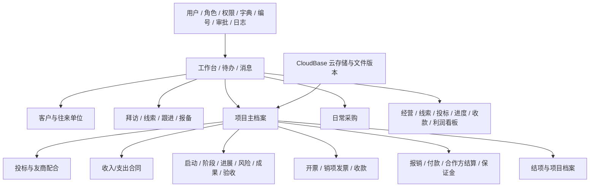
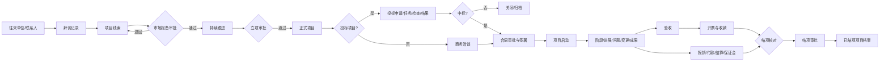
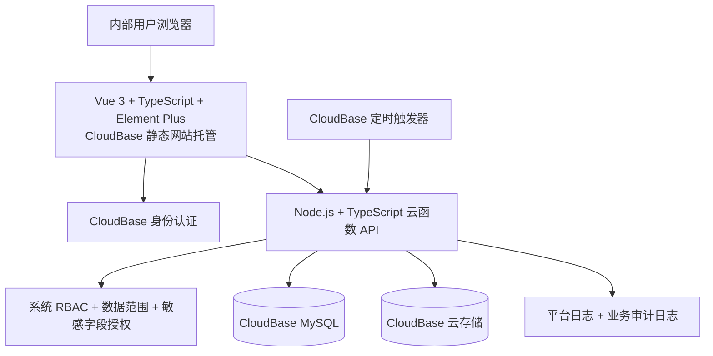
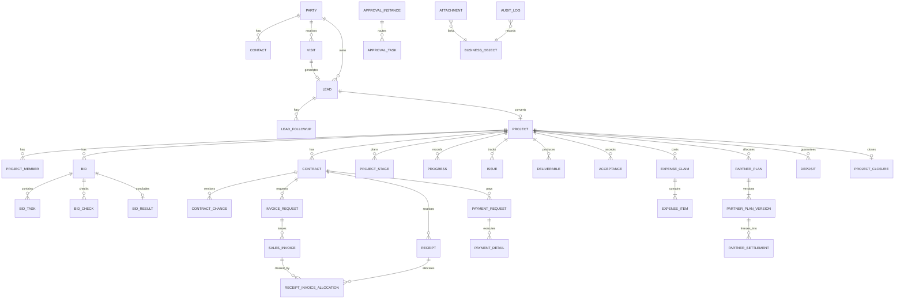

# 众肯科技项目全过程管理系统：需求评审修订基线 V2.2

> 依据《需求说明书 V2.1（CloudBase 部署版）》《开发前设计基线 V1.0》及专家评审结论修订。本文件已落实评审提出的 P0 问题，是数据库详细设计、原型、接口、权限、测试和正式编码的共同基线。
>
> 配置基线更新日期：2026-07-12。项目方已确认组织、审批岗位、特批结项、CloudBase 环境及数据初始化口径，详见第 17 节。
>
> 本项目为完整的新建系统，所有程序、数据库结构、接口和前端页面均从零开发；不包含旧系统改造、旧程序复用、旧接口兼容或历史数据迁移。

## 0. V2.2 修订结论

本次不扩张 ERP 范围，重点完成可编码性修订：

1. 区分预计成本、已确认成本、已支付金额和现金流出，消除重复计成本风险。
2. 固定预计利润、合同经营利润、现金贡献三套口径。
3. 立项申请编号与正式项目编号分离。
4. 项目主状态仅表达整体生命周期，投标、合同、开票和收款使用子业务状态。
5. 项目启动支持“正常启动”和“提前启动”两种类型。
6. 增加收款—发票核销明细；报销改为主表＋明细表。
7. 合作分配方案版本化，结算单生成时冻结计算快照。
8. 审批能力收敛为预设模板、顺序审批、金额阈值和抄送。
9. 明确用户名密码登录、CloudBase UID 映射、私有文件访问和生产资源门槛。
10. 增加定量非功能指标、数据权限算法与结果型验收用例。
11. 组织默认采用“公司—部门—人员”单层部门结构，部门、人员、角色及初始账号均可配置。
12. 审批只预设岗位，不绑定具体人员；岗位人员和金额阈值均由后台配置。
13. 允许对未收款、未退保证金或未关闭问题发起带遗留事项结项，仅公司负责人可特批。
14. 开发环境确认为广州南沙地域的 CloudBase 环境 `cloudbase-d7gc2b32cd4196059`。
15. 无历史数据迁移；基础字典和编号按一般规范初始化。

## 1. 总体功能结构图



## 2. 项目全过程业务流程图



## 3. 技术架构及 CloudBase 边界



- 前端绝不接触 MySQL 密码、SecretKey、API Key。
- 金额、审批、状态、导出、敏感附件操作全部经后端校验。
- 单体模块化架构，不引入微服务、Redis、消息中间件、Kubernetes、独立 Nginx。
- 金额统一 `DECIMAL(18,2)`；ID 推荐 `BIGINT UNSIGNED`，业务编号单独唯一索引。
- 所有核心表统一包含 `status/project_id/created_by/created_at/updated_by/updated_at/is_deleted/version`；无项目归属的基础表允许 `project_id` 为空。

## 4. 菜单和页面清单

| 一级菜单 | 页面 |
|---|---|
| 工作台 | 经营摘要、我的待办、我的项目、消息中心、临期与异常提醒 |
| 客户管理 | 往来单位列表/详情/编辑，联系人列表/详情/编辑，拜访记录列表/详情/编辑 |
| 市场线索 | 线索列表/详情/编辑，跟进记录，市场报备审批，重复线索校验 |
| 项目管理 | 项目列表、立项申请、项目详情全景页（含成员和启动信息）、项目时间轴、结项申请 |
| 投标管理 | 投标申请、任务分工、文件检查、投标结果、友商配合投标 |
| 合同管理 | 收入合同、支出合同、合同审批、合同变更、履约与到期提醒 |
| 项目实施 | 阶段计划、进展记录、问题风险、项目变更、成果、验收；启动作为项目详情操作 |
| 发票与收款 | 开票申请（含完成开票）、收款登记、发票核销、应收与逾期列表 |
| 费用与付款 | 费用报销、项目付款（含多次付款明细）、付款凭证、项目成本汇总 |
| 合作方结算 | 分配方案、结算单、结算审批、付款状态 |
| 保证金管理 | 保证金台账、缴纳付款、退回明细、逾期；缴纳复用付款流程 |
| 日常费用 | 日常采购/非项目费用申请、审批、完成、附件 |
| 统计报表 | 公司经营、市场线索、投标、项目进度、项目收款、项目利润 |
| 系统管理 | 用户、人员、角色、菜单权限、操作权限、数据范围、敏感字段、字典、编号规则、审批配置、参数、日志 |

所有业务对象统一提供：列表、详情、创建/编辑、审批记录、附件、操作日志；项目详情采用页签聚合全过程数据。用户直接填写的主表单控制在 24 种以内，审批过程、付款明细、退回明细、项目成员、合同节点和成果版本均作为主对象子表或操作，不额外制造一级表单。

## 5. 核心表单字段清单

以下字段为可落库的最小完整集；所有表单另含统一审计字段、状态字段、附件关联和审批实例 ID。

| 表单 | 核心字段 |
|---|---|
| 往来单位档案 | 单位编号、名称、简称、统一社会信用代码、单位类型、行业、规模、地区、地址、电话、网站、开户行、银行账号、税号、开票信息、负责人、来源、合作状态、备注 |
| 联系人档案 | 所属单位、姓名、性别、部门、职务、手机、电话、邮箱、微信、是否关键联系人、关系程度、决策角色、负责人、备注 |
| 人员档案 | 人员编号、姓名、人员类型、部门、岗位、手机、邮箱、入职/合作日期、离职日期、直属负责人、关联登录用户、账号状态 |
| 客户拜访记录 | 单号、客户、联系人、拜访日期/方式/地点、参与人员、拜访目的、沟通内容、客户需求、机会判断、下一步计划、下次跟进时间、负责人、是否生成线索 |
| 项目线索 | 线索编号、项目名称、客户、来源、来源说明、发现日期、预计金额、预计时间、项目类型、项目背景、需求概述、竞争情况、成功概率、负责人、协同人、报备状态、线索状态、下次跟进时间 |
| 跟进记录 | 线索、跟进日期、方式、参与人员、沟通内容、客户反馈、机会变化、成功概率、下一步计划、下次跟进时间、记录人 |
| 项目立项申请 | 立项申请编号、项目名称、客户、来源线索、项目类型、背景、服务范围、预计收入、预计成本、预计利润（自动计算）、预计起止日期、项目经理、成员建议、投标方式、风险、必要性、申请人；审批通过后才生成不可修改的正式项目编号 |
| 投标申请 | 项目、招标人/代理机构、招标编号、项目预算、投标限价、报名/购买/答疑/截止/开标时间、投标地点、投标方式、保证金、标书费、商务负责人、技术负责人、报价负责人、申请说明 |
| 投标任务 | 投标申请、任务类型、任务名称、责任人、协作人、开始/截止时间、交付要求、完成说明、检查人、状态 |
| 投标检查 | 投标申请、检查项、检查标准、责任人、检查结果、问题说明、整改人、整改期限、复查结果 |
| 投标结果 | 投标申请、开标日期、报价、排名、中标状态、中标金额、中标通知日期、未中标原因、竞争对手、复盘结论 |
| 友商配合投标 | 项目/线索、友商、最终客户、配合类型、报名/报价/投标时间、我方报价、责任人、结果、说明 |
| 合同登记 | 合同编号、名称、类型、项目、甲方、乙方、签约主体、金额、税率、含税标识、签订/生效/到期日期、服务内容、付款条件、开票条件、负责人、原合同/变更版本、履约状态 |
| 合同变更 | 合同、变更编号、变更类型、原金额、新金额、原工期、新工期、变更内容、原因、生效日期、申请人 |
| 项目启动信息 | 项目、启动类型（正常/提前）、启动日期、项目经理、成员与角色、目标、范围、阶段计划、沟通机制、交付物、风险；提前启动另含当前合同状态、提前原因、启动依据、预计合同金额、预计签订日期和待补签提醒 |
| 阶段计划 | 项目、阶段名称、顺序、计划起止、实际起止、负责人、阶段目标、交付物、完成比例、状态 |
| 项目进展 | 项目、阶段、记录日期、完成工作、当前进度、下步计划、偏差说明、需协调事项、记录人 |
| 问题风险 | 项目、类型、标题、描述、等级、影响、责任人、发现日期、计划解决日期、措施、实际解决日期、状态 |
| 项目变更 | 项目、变更类型、原内容、新内容、原因、影响范围、工期影响、金额影响、申请人、生效日期 |
| 成果提交 | 项目、阶段、成果名称、成果类型、版本、提交日期、提交人、接收人、成果说明、确认结果、状态 |
| 验收申请 | 项目、合同、验收类型、申请日期、验收范围、验收依据、验收日期、验收单位、验收结果、遗留问题、整改期限 |
| 开票申请 | 项目、收入合同、申请金额、发票类型、税率、开票内容、购买方信息、计划开票日、收款条件、申请人 |
| 销项发票 | 开票申请、项目、合同、发票号码、发票代码、开票日期、含税金额、不含税金额、税额、购买方、红冲标识、附件 |
| 收款登记 | 项目、收入合同、客户、收款日期、金额、收款账户、付款单位、付款账号、收款类型（预收/正常/其他）、凭证号、经办人；不保存单一发票 ID |
| 收款—发票核销明细 | 收款、发票、本次对应金额、核销日期、操作人；支持一收多票、一票多收、预收款暂不核销，分配总额不得超过收款余额或发票未核销额 |
| 报销单主表 | 单号、报销人、部门、关联项目（可空）、报销事由、明细汇总总额、支付对象、收款账户、审批状态、付款状态 |
| 报销明细 | 报销单、费用类型、发生日期、金额、说明、是否有票、发票号码/开票方、附件；主表总额由有效明细自动汇总，禁止手工覆盖 |
| 项目付款 | 项目、支出合同/报销/结算/保证金等来源对象、收款单位/个人、付款类型、申请金额、计划日期、付款依据、收款账户、是否需票、经办人 |
| 付款明细 | 付款申请、项目、付款日期、金额、付款账户、收款账户、流水号、凭证附件、登记人；一张申请可多次付款，不单列一级页面 |
| 合作分配方案 | 项目、合作方、方案版本、结算方式、固定金额/比例、计算基数、可扣减成本范围、上限、下限、生效起止日期、条件、负责人、启用状态 |
| 合作方结算单 | 项目、方案及版本、合作方、结算期间、基数快照、比例快照、规则快照、应结金额、已结金额、扣减、实结金额、舍入差额、开票要求、付款状态；生成后历史计算条件冻结 |
| 保证金登记 | 项目、投标/合同、类型、收付方向、对象、金额、应缴日期、实缴日期、应退日期、实退日期、账户、状态 |
| 日常采购申请 | 申请人、部门、采购类型、供应商、物品/服务、数量、预算金额、用途、期望日期、付款方式、是否关联合同；关联合同时仅允许选择有效支出合同，供应商必须与合同乙方一致，未手工选择供应商时默认取合同乙方 |
| 项目结项申请 | 项目、申请日期、完成情况、验收结论、合同金额、开票/收款/成本/结算汇总、未了事项、文件归档检查、利润口径、结项说明；带遗留事项结项另含遗留类型、事项说明、责任人、完成期限、特批意见 |

## 6. 表单关联关系与 ER 图



统一关联原则：业务表优先保存 `project_id`；合同、投标、发票、收付款等再保存各自直接上游 ID；附件通过 `business_type + business_id + project_id` 关联；审批实例通过 `business_type + business_id` 关联。收款与发票通过核销明细形成多对多关系；报销、付款和合作方方案采用主从或主版本结构，所有主表汇总金额均由有效明细计算。

## 7. 核心状态机

| 对象 | 状态流转 |
|---|---|
| 线索 | 草稿 → 待报备 → 已退回/已驳回/跟进中 → 已转项目；任一有效阶段可按权限关闭为已失效 |
| 立项申请 | 草稿 → 审批中 → 已退回/已驳回/已撤回/已通过；仅已通过生成正式项目 |
| 项目 | 已立项 → 前期准备 → 待启动 → 实施中 → 待验收 → 已验收 → 待结项 → 已结项；旁路：暂停、恢复到原状态、已终止、已取消。投标、商务、合同、开票和收款状态不写入项目主状态 |
| 投标 | 草稿 → 审批中 → 准备中 → 已提交 → 已开标 → 中标/未中标/流标/放弃 |
| 投标任务 | 待分配 → 待处理 → 处理中 → 待检查 → 已完成；旁路：逾期/取消 |
| 合同 | 草稿 → 审批中 → 待签署 → 履行中 → 已完成；旁路：已退回/已驳回/已变更/已终止/已作废 |
| 阶段 | 未开始 → 进行中 → 待确认 → 已完成；旁路：延期/暂停/取消 |
| 问题风险 | 待处理 → 处理中 → 待验证 → 已关闭；旁路：重新打开 |
| 成果 | 草稿 → 已提交 → 待确认 → 已确认；旁路：退回修改/已废止 |
| 验收 | 草稿 → 审批中 → 待验收 → 已通过/有条件通过/未通过 → 已完成 |
| 开票申请 | 草稿 → 审批中 → 待开票 → 部分开票 → 已开票；旁路：退回/驳回/撤回/作废 |
| 费用/付款 | 草稿 → 审批中 → 待支付 → 部分支付 → 已支付；旁路：退回/驳回/撤回/作废 |
| 合作方结算 | 草稿 → 核算中 → 审批中 → 待开票/待付款 → 部分付款 → 已结清 |
| 保证金 | 待缴纳 → 已缴纳 → 待退回 → 已退回；旁路：逾期/没收/作废 |
| 结项 | 草稿 → 审批中 → 财务核对 → 经营审核 → 负责人审批 → 已结项；旁路：退回/驳回/撤回 |

所有状态变化由后端状态机执行并新增状态历史，禁止客户端直接写状态文本。

## 8. 审批流程清单

| 事项 | 默认审批链（后台可配置） |
|---|---|
| 市场报备 | 线索负责人 → 经营负责人/公司负责人 |
| 项目立项 | 申请人 → 经营负责人 → 公司负责人 |
| 投标申请 | 项目/商务负责人 → 经营负责人 → 公司负责人 |
| 合同 | 经办人 → 项目负责人 → 财务核对 → 公司负责人 |
| 项目启动 | 项目经理 → 经营负责人/公司负责人确认 |
| 项目变更 | 项目经理 → 经营负责人 → 金额/工期阈值触发公司负责人 |
| 开票申请 | 项目经理/经办人 → 财务 → 授权负责人 |
| 费用报销 | 申请人 → 项目负责人/部门负责人 → 财务 → 金额阈值审批人 |
| 项目付款 | 经办人 → 项目负责人 → 财务 → 金额阈值审批人 |
| 合作方结算 | 项目负责人 → 财务复核 → 公司负责人 |
| 保证金 | 经办人 → 项目负责人 → 财务 → 授权负责人 |
| 日常采购 | 申请人 → 部门负责人 → 财务/采购 → 金额阈值审批人 |
| 项目结项 | 项目经理 → 财务核对 → 经营负责人 → 公司负责人 |

审批能力采用约 12 套预设顺序模板。保留提交、同意、退回修改、驳回、撤回和抄送；管理员只配置节点岗位、顺序、金额阈值和抄送岗位，具体审批人由岗位任职配置解析。首版不建设转交、加签、会签比例、嵌套条件、动态并行、自由跳转、拖拽或用户自定义流程。流程配置和审批历史存数据库，不把审批人写死在代码中。

组织与审批配置采用以下固定原则：组织默认仅建“公司—部门—人员”一层部门关系，不启用多级部门递归；经营负责人、公司负责人、财务复核人等均作为岗位或审批角色预设，不绑定具体人员。管理员可配置各岗位任职人员、代理/启停状态及各流程金额阈值，阈值变更仅影响新发起的审批实例，历史实例保留发起时的审批配置快照。

## 9. 用户角色权限矩阵

符号：`管`=管理，`编`=在数据范围内维护，`看`=查看，`审`=审批，`—`=默认无权；敏感金额仍需单独授权。

| 模块 | 管理员 | 公司负责人 | 市场商务 | 项目经理 | 项目成员 | 投标人员 | 财务资金 | 普通员工 |
|---|---:|---:|---:|---:|---:|---:|---:|---:|
| 系统配置 | 管 | 看 | — | — | — | — | — | — |
| 客户/联系人/拜访 | 看 | 看 | 编 | 看 | 看 | — | 看 | — |
| 线索/报备 | 看 | 审 | 编 | 看 | 看 | — | 看 | — |
| 立项/项目主档 | 看 | 审/管 | 编 | 编 | 看 | 看 | 看 | 看 |
| 投标 | 看 | 审 | 编 | 编 | 看 | 编 | 看 | — |
| 合同 | 看 | 审/看 | 编 | 看 | — | — | 编/审 | — |
| 项目实施 | 看 | 看 | 看 | 管 | 编 | — | 看 | 看 |
| 开票/收款 | 看 | 审/看 | 看 | 编 | — | — | 管 | — |
| 费用/付款 | 看 | 审/看 | 看 | 编/审 | — | — | 管/审 | 编本人 |
| 合作方结算 | 看 | 审/看 | — | 编 | — | — | 编/审 | — |
| 保证金 | 看 | 审/看 | 编 | 编 | — | 编 | 管 | — |
| 日常采购 | 看 | 审/看 | 编本人 | 编本人 | 编本人 | 编本人 | 编/审 | 编本人 |
| 看板/利润 | — | 看 | 范围内 | 范围内 | — | — | 看 | — |
| 审计日志 | 管 | 看 | — | — | — | — | 授权看 | — |

管理员默认不获得工资、利润、合作分成、银行账户等敏感字段查看权。数据范围支持全部、本部门、本人负责、本人参与、本人创建、指定项目。

### 9.1 数据权限计算规则

后端对每个请求按“功能权限 ∩ 数据范围 ∩ 敏感字段权限 ∩ 业务状态权限”计算最终权限：

1. 用户可有多个角色；功能权限和数据范围取角色授权并集，但显式禁用用户、显式拒绝敏感字段优先。
2. 全部数据：不追加归属过滤；本部门：匹配当前用户部门，默认不递归子部门；本人负责：匹配对象负责人；本人参与：必须存在有效项目成员关系；本人创建：匹配创建人；指定项目：匹配有效项目授权记录。
3. 一条记录满足任一已授权数据范围即可查看，但编辑、审批、导出还必须分别具有对应操作权限。
4. 银行账号、利润、合同金额、成本、合作比例、结算金额等字段由后端移除或脱敏，不依赖前端隐藏。
5. 列表、详情、聚合、导出、附件下载使用同一权限过滤器，防止统计或导出旁路越权。
6. 临时项目授权具有起止时间和授权人；项目成员退出后即时失去“本人参与”数据范围。

## 10. 原型页面（低保真）

### 10.1 工作台

```text
┌ 左侧菜单 ─┬────────────────────────────────────────────┐
│ 工作台     │ 项目数  合同额  已开票  已收款  未收款  预计利润 │
│ 客户管理   ├──────────────────────┬─────────────────────┤
│ 市场线索   │ 我的待办              │ 临期与异常            │
│ 项目管理   │ [立项审批] [付款审批] │ 投标截止/应收逾期/... │
│ ...        ├──────────────────────┴─────────────────────┤
│ 系统管理   │ 项目状态分布 / 收款趋势 / 最近动态          │
└────────────┴────────────────────────────────────────────┘
```

### 10.2 通用列表页

```text
[关键词] [状态▼] [负责人▼] [日期范围] [查询] [重置]    [+ 新建] [导出]
┌□─编号────名称────────客户────负责人────状态────更新时间──操作┐
│□  ...     ...         ...     ...       ...      ...       查看│
└──────────────────────────────────────────────────────────────┘
                                      第 1/20 页  < 1 2 3 >
```

### 10.3 项目详情全景页

```text
项目编号 / 项目名称       [实施中]   负责人   客户   合同额   收款率
[概况][成员][线索][投标][合同][阶段进度][问题风险][成果][验收]
[开票收款][费用付款][合作方结算][保证金][项目利润][文件][操作日志]
──────────────────────────────────────────────────────────────
左：当前页签业务数据                 右：项目时间轴 / 待办 / 快捷操作
```

### 10.4 表单与审批页

```text
基础信息  → 业务信息 → 金额/计划 → 附件 → 提交确认
[保存草稿] [提交审批]
右侧：当前节点、审批人、完整审批轨迹、退回意见
```

## 11. 数据库模块划分

- `iam_*`：用户、员工、角色、权限、用户角色、角色权限、数据范围、敏感字段授权。
- `sys_*`：字典、编号规则、参数、消息、通知模板、审计日志。
- `crm_*`：往来单位、联系人、拜访。
- `mkt_*`：线索、跟进、市场报备。
- `prj_*`：项目、成员、状态历史、启动、阶段、进展、问题、变更、成果、验收、结项。
- `bid_*`：投标、任务、检查、结果、友商配合。
- `con_*`：合同、付款/开票条款、合同变更与版本。
- `fin_*`：开票申请、销项发票、收款、报销、付款申请、实际付款、保证金、日常采购。
- `partner_*`：合作分配方案、合作方结算。
- `wf_*`：预设模板、顺序节点、金额阈值、实例、任务、动作历史、抄送；不支持任意流程设计。
- `file_*`：文件元数据、业务关联、版本、访问日志。

### 11.1 字段级数据字典约束

详细建表阶段必须以本节和第 5 节字段清单为准，不得自行改变业务含义：

| 字段类别 | MySQL 类型/约束 | 统一规则 |
|---|---|---|
| 主键 | `BIGINT UNSIGNED` | 后端生成或数据库生成；前端不得信任自报主键 |
| 业务编号 | `VARCHAR(32)` | 非空、唯一索引、生成后不可修改 |
| 外键/逻辑关联 | `BIGINT UNSIGNED` | 关键主从关系使用外键或等价的事务内存在性校验并建索引 |
| 金额 | `DECIMAL(18,2)` | 禁止 FLOAT/DOUBLE；非负字段加业务校验 |
| 比例 | `DECIMAL(9,6)` | 数据库存 0～1，小数计算后 `ROUND_HALF_UP` 到金额分 |
| 日期 | `DATE` | 仅表达自然日；无时区换算 |
| 时间 | `DATETIME(3)` | 服务端统一写入，接口使用 ISO 8601；展示按 Asia/Shanghai |
| 状态/类型 | `VARCHAR(32)` | 仅接受后端枚举代码，中文为字典显示值，不存自由文本 |
| 长文本 | `TEXT` | 富文本须清洗；普通说明禁止存可执行 HTML |
| 布尔值 | `TINYINT(1)` | 仅 0/1，设置明确默认值 |
| 乐观锁 | `INT UNSIGNED version` | 初始 1，更新时校验并递增 |
| 逻辑删除 | `TINYINT(1) is_deleted` | 默认 0；审批通过业务原则上只作废不删除 |
| 审计字段 | 创建/修改人和时间 | 核心表非空，由后端从会话写入 |

P0 关系表逐字段定义如下，其余业务表在初始化建表脚本定稿前按相同格式展开并接受字段审计：

| 表 | 字段 | 类型 | 必填/约束 | 含义与验收 |
|---|---|---|---|---|
| `pm_initiation` | `application_no` | VARCHAR(32) | 非空唯一 | `LA-YYYY-NNNN`，退回重提不改变 |
| `pm_initiation` | `lead_id` | BIGINT UNSIGNED | 可空；有效线索唯一约束由事务校验 | 来源线索 |
| `pm_project` | `project_no` | VARCHAR(32) | 非空唯一不可修改 | 仅立项通过生成 `ZK-YYYY-NNNN` |
| `fin_receipt_invoice_allocation` | `receipt_id` | BIGINT UNSIGNED | 非空联合索引 | 收款 ID |
| `fin_receipt_invoice_allocation` | `invoice_id` | BIGINT UNSIGNED | 非空联合索引 | 发票 ID |
| `fin_receipt_invoice_allocation` | `allocated_amount` | DECIMAL(18,2) | 大于 0 | 不得超过收款余额和发票未核销额 |
| `fin_receipt_invoice_allocation` | `allocated_at` | DATETIME(3) | 非空 | 核销时间 |
| `fin_receipt_invoice_allocation` | `operator_id` | BIGINT UNSIGNED | 非空 | 操作人 |
| `fin_expense_claim` | `total_amount` | DECIMAL(18,2) | 非空、只读汇总 | 等于有效明细金额之和 |
| `fin_expense_item` | `claim_id` | BIGINT UNSIGNED | 非空索引 | 报销主表 |
| `fin_expense_item` | `expense_type` | VARCHAR(32) | 非空枚举 | 费用类型 |
| `fin_expense_item` | `occurred_on` | DATE | 非空 | 发生日期 |
| `fin_expense_item` | `amount` | DECIMAL(18,2) | 大于 0 | 明细金额 |
| `fin_expense_item` | `has_invoice` | TINYINT(1) | 非空默认 0 | 是否有票 |
| `fin_payment_detail` | `payment_request_id` | BIGINT UNSIGNED | 非空索引 | 来源付款申请 |
| `fin_payment_detail` | `paid_amount` | DECIMAL(18,2) | 大于 0 | 累计不得超过批准金额 |
| `partner_plan_version` | `version_no` | INT UNSIGNED | 项目+方案内唯一 | 方案版本号 |
| `partner_plan_version` | `basis_type` | VARCHAR(32) | 非空枚举 | 固定额/合同不含税/实收/毛利 |
| `partner_plan_version` | `share_rate` | DECIMAL(9,6) | 比例模式必填，0～1 | 分成比例 |
| `partner_settlement` | `basis_snapshot` | DECIMAL(18,2) | 非空 | 生成时冻结的基数 |
| `partner_settlement` | `rate_snapshot` | DECIMAL(9,6) | 按比例时非空 | 生成时冻结的比例 |
| `partner_settlement` | `rule_snapshot` | JSON | 非空 | 可扣成本、舍入和版本等不可变快照 |
| `partner_settlement` | `confirmed_cost_amount` | DECIMAL(18,2) | 审批通过后非空 | 只计一次已确认成本 |
| `fin_deposit` | `occupied_amount` | DECIMAL(18,2) | 非负 | 已缴未退资金占用，不计成本 |
| `fin_deposit` | `loss_confirmed_amount` | DECIMAL(18,2) | 默认 0 | 没收且损失审批后才计成本 |

字段敏感级别使用 `PUBLIC/INTERNAL/SENSITIVE/RESTRICTED` 四级；合同金额和普通成本为 `SENSITIVE`，利润、合作比例、结算金额、银行账号为 `RESTRICTED`。完整字段字典将作为版本化数据库设计文件，与初始化建表脚本同步交付并自动校验金额类型、索引和非空约束。

## 12. 关键业务规则

1. 已提交审批不可物理删除；审批通过只能作废并记录原因。
2. 已有关联合同、收付款或结算的数据不可删除。
3. 立项申请编号默认 `LA-YYYY-NNNN`；审批通过后生成正式项目编号 `ZK-YYYY-NNNN`。未通过申请不占正式编号；同一线索最多关联一个非取消/非终止的正式项目；正式项目编号生成后不可修改。
4. 合同累计开票不得超过有效合同可开票金额（授权的调整流程除外）；合同有效金额取已生效主合同及补充协议净额，作废/终止未履行部分不计入，暂定金额默认不进入合同利润，待确认为正式金额后进入。
5. 合同累计收款、付款、核销、结算均按有效明细实时汇总，禁止人工覆盖汇总值。
6. 项目结项前校验验收、应收、应付、保证金、成果归档和未关闭问题。存在未收款、未退保证金或未关闭问题时，允许发起“带遗留事项结项”，但仅公司负责人可以特批；申请必须逐项记录遗留事项、责任人和完成期限，逾期持续提醒并保留跟踪记录。
7. 合作方案默认支持固定金额、有效收入合同不含税金额、实际收款金额、项目毛利四种基数。采用十进制 `ROUND_HALF_UP` 四舍五入到分；同一项目同一基数下有效合作方比例合计默认不得超过 100%，超出必须阻止启用。毛利基数只扣除已确认直接项目成本，不扣保证金、未确认预算和内部资金调拨。
8. 所有写接口使用事务；提交、审批、付款登记等接口使用幂等键防重复。
9. 列表强制分页；导出受权限、数据范围、数量上限控制并记录日志。
10. 文件下载先校验业务对象权限；重要文件新增版本而非覆盖。
11. 所有经营看板显著标注“内部项目经营口径，不属于会计利润”。

### 12.1 成本与资金口径

| 指标 | 固定计算规则 | 进入时点 |
|---|---|---|
| 预计成本 | 立项预计成本及批准后的预算调整 | 立项或预算变更生效 |
| 已确认成本 | 已审批报销明细＋已审批合作方结算＋已确认支出合同履约金额＋经批准转损失的保证金 | 各来源单据达到确认节点 |
| 已支付金额 | 来源为项目经营支出的有效付款明细合计 | 实际付款登记完成 |
| 现金流出 | 项目实际经营付款合计 | 实际付款登记完成 |
| 资金占用 | 已缴未退保证金等暂时性资金占用 | 缴纳至退回/转损失期间 |

- 付款申请审批不新增成本；付款明细只更新已支付和现金流，不重复增加已确认成本。
- 报销审批通过形成已确认成本；后续付款只更新支付指标。
- 合作方结算审批通过形成已确认成本；生成付款申请和实际付款均不得再次计成本。
- 投标、履约等保证金支付和退回不进入成本或利润；仅在确认没收并通过损失确认后计入已确认成本。
- 支出合同不得以“合同金额”和“报销/结算来源”重复确认同一义务；来源类型和来源 ID 必须唯一追踪，冲销采用反向明细。

### 12.2 利润与贡献口径

| 指标 | 固定公式 | 用途 |
|---|---|---|
| 预计利润 | 预计收入（默认不含税）－预计成本 | 立项决策 |
| 合同经营利润 | 有效收入合同确认金额（默认不含税）－已确认项目成本 | 项目经营判断 |
| 现金贡献 | 项目累计实际收款－项目实际经营付款 | 资金分析 |

- 未支付但已审批的合作方结算进入合同经营利润成本，不进入已支付金额。
- 保证金支付与退回均不影响上述三种利润，只展示资金占用；没收转损失后影响合同经营利润。
- 多份有效收入合同按项目汇总；补充协议按净变更额调整；作废合同不计，已部分履行终止合同只计确认履行额。
- 暂定金额默认不计合同经营利润；经合同变更确认后计入。
- 含税合同必须保存含税金额、不含税金额、税率和税额，利润默认按不含税口径；无法拆税的历史记录显著标注“含税估算”。

### 12.3 合作方结算冻结规则

1. 方案每次变更产生新版本及生效日期，不覆盖旧版本。
2. 结算单生成时复制方案版本、基数数据、比例、可扣成本范围、舍入规则和计算结果快照。
3. 后续方案修改不改变历史结算；已结算部分不重新计算，新规则仅影响生效后的新结算期间。
4. 系统按“理论累计可结算－历史有效已结算”计算本次上限，禁止超额提交。

### 12.4 提前启动规则

正常启动要求至少存在已签署或履行中的有效合同。无正式合同先开展工作时，项目经理必须选择“提前启动”，提交启动依据、范围、预计金额、预计签约日期和风险，经公司负责人审批后方可进入实施中。系统持续生成合同待补签提醒；超过预计签约日期后标记异常，但不删除既有实施记录。

## 13. CloudBase 落地与安全基线

### 13.1 登录和用户映射

- 首版采用 CloudBase 用户名＋密码认证，禁止员工自行注册，由系统管理员统一创建账号。
- CloudBase `uid` 与内部 `iam_user.id` 一对一映射且唯一；内部用户保存员工、部门、启停状态和最后同步时间，不保存明文密码。
- 初次登录强制修改初始密码；密码重置由管理员发起，保留邮箱验证码找回接口但默认关闭。
- 连续 5 次失败锁定 15 分钟；管理员、公司负责人和财务角色预留增强验证开关。
- 离职或停用时先禁用内部用户并使会话失效，再停用 CloudBase 身份；所有接口同时检查 CloudBase 会话和内部启用状态。

### 13.2 私有文件

- 业务文件默认私有，禁止匿名或公开 URL 长期访问。
- 下载流程固定为：前端申请 → 后端验证功能、数据范围、敏感字段/附件权限和业务状态 → 生成短时临时地址 → 记录访问日志。
- 默认单文件上限 100MB；允许 PDF、DOC/DOCX、XLS/XLSX、常见图片、ZIP；EXE、DLL、BAT、CMD、PS1、JS、SH 等可执行或脚本文件默认拒绝。
- 重要附件只新增版本不覆盖；业务记录作废后仍保留；物理删除仅限授权管理员并记录原因和审计日志。

### 13.3 云函数和事务边界

后端按身份权限、客户市场、项目、投标合同、项目实施、收入收款、费用付款结算、文件、审批消息、报表定时任务划分约 10 个业务域函数，不按每张表拆函数。同一业务动作中的数据更新、状态历史、审批任务和审计日志必须在同一数据库事务内完成；跨域异步任务使用可重试任务表和幂等键保证最终一致。

### 13.4 环境与生产门槛

当前开发环境采用 CloudBase 环境 `cloudbase-d7gc2b32cd4196059`，地域为广州南沙；MySQL 等基础资源已开通。数据库账号、连接信息、存储与云函数配额等在开发接入时由项目方提供或核验，所有密码、SecretKey、API Key 等敏感配置仅允许通过本地 `.env`（不得提交版本库）或 CloudBase 平台环境变量注入，禁止写入源码、文档示例和前端构建产物。

免费环境仅用于开发、测试、演示和短期试运行。正式承载合同、付款、成果和合作结算数据前，必须完成资源、连接数、备份、恢复、配额、有效期和费用评估，并由项目负责人书面确认环境满足生产要求；不以删减安全、日志或备份换取免费运行。生产环境与测试环境原则上分离。

## 14. 非功能验收基线

### 14.1 性能与容量

- 基准数据：不少于 3000 个项目、10000 份合同、50000 条费用及付款明细。
- 列表默认每页 20 条，可切换 50 条，禁止全表加载。
- 30 名用户并发执行典型查询、保存和审批；在约定的生产级 CloudBase 资源及正常企业网络下，95% 普通请求 3 秒内完成，普通保存、提交和审批 5 秒内完成。
- 1000 条以上或预计超过 10 秒的导出转后台任务，不能阻塞普通请求；导出文件有权限和有效期控制。

### 14.2 备份恢复

- 数据库每日自动备份，关键发布前手工备份，备份至少保留 30 天。
- 项目附件启用平台保护能力或定期备份；数据库与附件恢复点需保持可对应。
- 目标 RPO 不超过 24 小时，RTO 不超过 8 小时。
- 上线前完成一次数据库和附件恢复演练，此后至少每半年验证一次，并保存演练记录。

### 14.3 客户端兼容

- 支持 Windows 10 及以上、验收时最新稳定版 Chrome 与 Edge。
- 响应式支持手机浏览器查看、审批和填写简单表单；合同、标书等复杂维护以电脑端为主。
- 首版不开发独立原生 App。

## 15. 开发实施顺序与整体验收

1. 工程骨架、CloudBase 接入、身份认证、RBAC、数据库初始化、审计日志。
2. 基础档案、客户拜访、线索、跟进、立项与项目主档。
3. 通用审批引擎、站内消息、状态机、附件服务。
4. 投标、合同、项目实施、成果与验收。
5. 开票收款、费用付款、合作方结算、保证金、日常采购。
6. 结项、项目全景页、经营看板、导出与定时提醒。
7. 安全、性能、备份恢复、部署演练、验收用例与操作手册。

最终仍按需求一次性整体验收上线，不将上述顺序解释为删减范围或分期交付。

## 16. 结果型验收用例

除原需求的端到端场景外，至少通过以下计算与约束用例：

| 编号 | 测试数据与操作 | 预期结果 |
|---|---|---|
| AC-01 | 合同 100 万元，先后开票 30 万、50 万，再申请 30 万 | 累计开票 80 万、可开 20 万；第三次普通申请被阻止 |
| AC-02 | 一张 50 万发票，分两次收款并核销 20 万、30 万 | 发票已核销 50 万，合同累计收款正确，发票状态为已核销 |
| AC-03 | 一笔 60 万收款分别核销两张发票 20 万、30 万 | 核销 50 万，收款未分配余额 10 万；不得分配超过余额 |
| AC-04 | 合作方按实际收款 20% 结算；项目收款 100 万，历史已结 10 万 | 本次最多可结 10 万，超过额度禁止提交 |
| AC-05 | 合作方结算 10 万审批通过，后续实际付款 10 万 | 已确认成本保持 10 万，已支付金额变为 10 万，不重复为 20 万 |
| AC-06 | 支付保证金 5 万后全额退回 | 支付后成本不变、资金占用 5 万；退回后占用归零，利润不变 |
| AC-07 | 保证金 5 万被没收并完成损失确认审批 | 审批前不计成本；审批后已确认成本增加 5 万并有来源追踪 |
| AC-08 | 报销单含 1000、2000、500 三条明细 | 主表总额自动为 3500；接口拒绝提交不一致的人工总额 |
| AC-09 | 立项申请被驳回后再次修改提交并通过 | 始终保留同一申请编号；驳回时无项目编号；通过后仅生成一个正式项目编号 |
| AC-10 | 未签合同项目申请正常启动 | 系统阻止；改为提前启动并审批通过后允许实施，同时生成补签提醒 |
| AC-11 | 修改已产生结算单的合作方案比例 | 历史结算金额和快照不变，新比例仅影响生效后的新结算 |
| AC-12 | 项目成员访问无关项目详情、导出及附件地址 | 三种入口均拒绝；审计日志记录拒绝事件，不泄露敏感字段 |
| AC-13 | 合同暂定金额 100 万但未确认 | 不进入合同经营利润；确认变更生效后按不含税确认额进入 |
| AC-14 | 30 用户在基准数据量下混合查询、保存和审批 | 95% 普通请求 ≤3 秒，保存/提交/审批 ≤5 秒，无重复审批或越权 |
| AC-15 | 项目仍有未收款、未退保证金和未关闭问题时申请结项 | 普通结项被阻止；完整填写各遗留事项责任人和期限后可发起特批，且只有公司负责人通过后才能结项并持续跟踪遗留事项 |

每个核心字段还应在详细数据字典中定义：中文名、英文名、类型、长度/精度、必填、默认值、枚举、校验、唯一性、索引、敏感级别、数据来源、可编辑状态和验收样例。

## 17. 已确认配置与开发期提供项

1. **组织与账号**：采用“公司—部门—人员”单层部门结构；系统支持维护部门、人员、角色及初始账号。具体名单作为上线初始化数据，在联调或上线准备阶段由项目方提供，不影响数据模型和功能开发。
2. **审批岗位与阈值**：只预设经营负责人、公司负责人、财务复核人等岗位，不写死具体人员；岗位任职人员可配置。各审批金额阈值可在后台自定义，并按审批实例保存配置快照。
3. **带遗留事项结项**：允许项目在存在未收款、未退保证金或未关闭问题时申请结项；仅公司负责人可特批，且必须填写每项遗留事项的责任人和完成期限。
4. **CloudBase 环境**：环境 ID 为 `cloudbase-d7gc2b32cd4196059`，地域为广州南沙，MySQL 等基础资源已开通。数据库账号、连接参数、存储及函数实际额度在开发接入时提供或核验；密钥仅通过本地 `.env` 或平台环境变量提供，严禁入库。
5. **初始化与历史数据**：没有历史数据，无存量迁移和旧合同兼容处理。基础字典按常用业务规范预置并支持后台维护；业务编号默认按年度从 `0001` 起编（如 `LA-YYYY-0001`、`ZK-YYYY-0001`），并允许在正式启用前配置前缀、位数和起始值。新合同统一保存含税金额、不含税金额、税率和税额，利润按不含税口径计算。

开发期仍需项目方提供的仅为敏感连接参数、实际资源额度，以及联调/上线所需的组织人员和初始账号明细；这些内容属于部署与初始化输入，不再作为需求范围待确认项。

## 18. 基线确认标准

确认本文件即表示：功能边界、页面范围、核心字段、状态机、审批模型、数据关系、权限模型、计算口径、非功能指标和 CloudBase 技术路线可作为详细设计及正式编码依据。后续新增范围应进入变更清单，并评估数据库、接口、权限、测试和交付影响。
